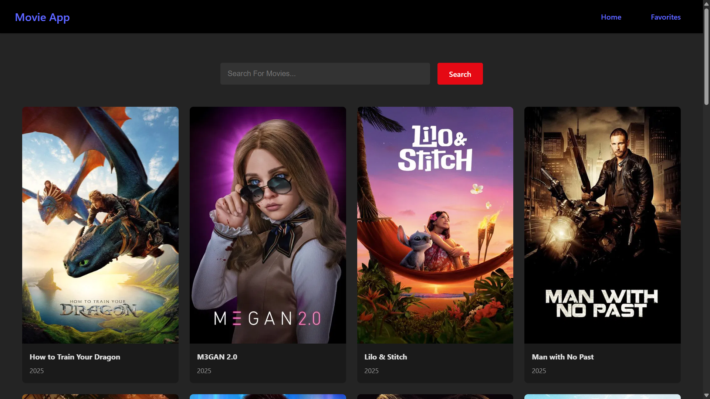
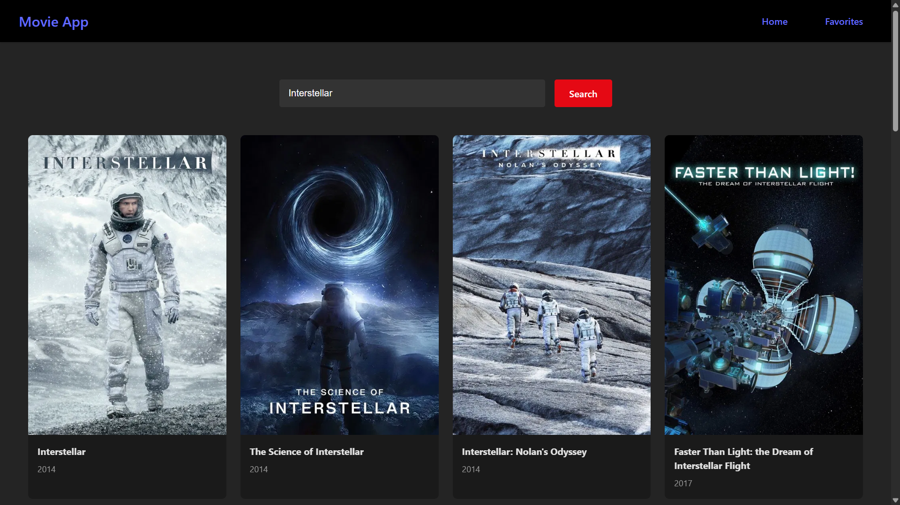
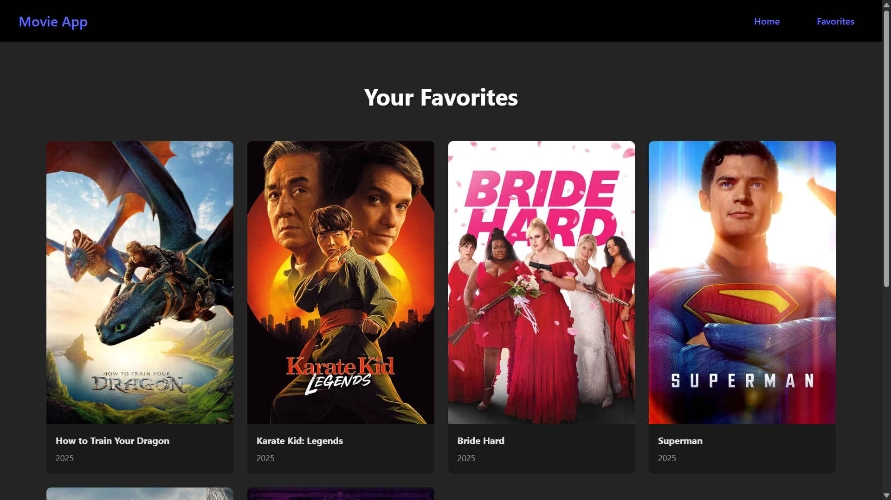

<div id="top"></div>

<div align="center">

# 🎬 MOVIE-APP
*Discover, Search & Save Your Favorite Movies Effortlessly*


*Built with the tools and technologies:*


</div>

---

## 📸 Screenshots

| Home Page | Search Results | Favorite Page |
| :--: | :--: | :--: |
|  |  |  |

---

## 📑 Table of Contents

- [Overview](#overview)
- [Demo](#demo)
- [Getting Started](#getting-started)
  - [Prerequisites](#prerequisites)
  - [Installation](#installation)
  - [Environment Variables](#environment-variables)
  - [Usage](#usage)
- [Features](#features)
- [Folder Structure](#folder-structure)
- [License](#license)

---

## 🧐 Overview

**Movie-App** is a sleek and responsive React-based application that allows users to browse popular movies, search by title, and save their favorite picks. It utilizes **TMDB API** to fetch dynamic movie data and **localStorage** to persist user favorites.

---

## 🔗 Demo

> Live Preview: [🎥 Movie-App Demo](https://movie-app-two-cyan-50.vercel.app/)  

---

## 🚀 Getting Started

### ✅ Prerequisites

- **Programming Language:** JavaScript
- **Package Manager:** npm

---

### ⚙️ Installation

```bash
# Clone the repository
git clone https://github.com/Surya821/Movie-App

# Navigate to the project directory
cd Movie-App

# Install dependencies
npm install
```

---

## ▶️ Usage
Run the project locally with:
```
npm start
```

---

